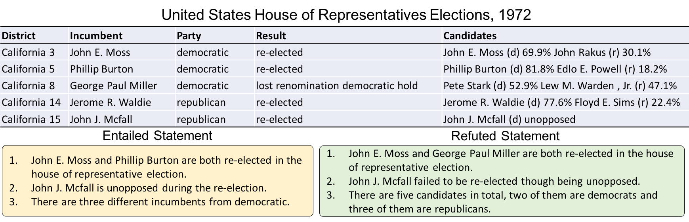
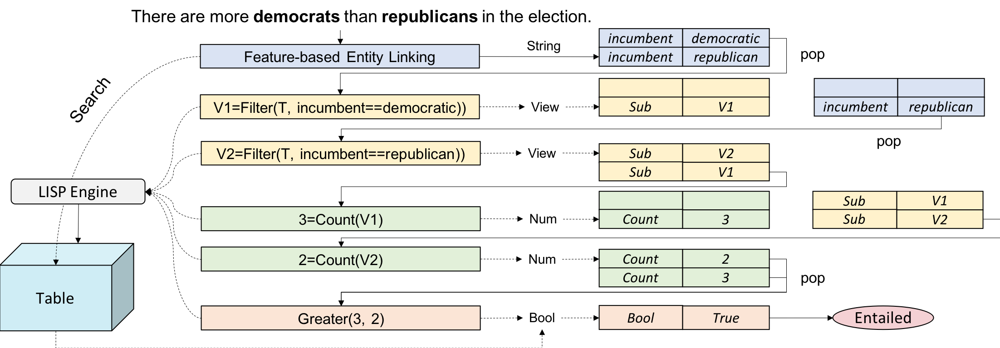
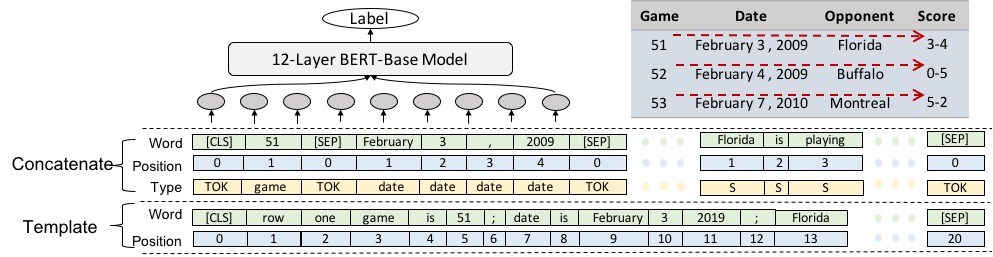

# Introduction
We introduce a large-scale dataset called **TabFact**(website: https://tabfact.github.io/), which consists of 117,854 manually annotated statements with regard to 16,573 Wikipedia tables, their relations are classified as *ENTAILED* and *REFUTED*. The full paper is accepted to ICLR2020 with openreview link "[TabFact: A Large-scale Dataset for Table-based Fact Verification
](https://openreview.net/forum?id=rkeJRhNYDH)". In this project, we aim to challenge the deep learning model's capability to handle both semantic inference and symbolic inference simultaneously.

<p align="center">

</p>
TabFact is the first dataset to evalaute language inference on strctured data, which involves mixed reasoning skills in both symbolic and linguistic aspects. Therefore, we propose two separate models, namely Table-BERT and the Latent Program Algorithm to tackle this task, they both have pros and conds.

- The brief architecture of Latent Program Algorithm (LPA) looks like following:
<p align="center">

</p>

- The brief architecture of Table-BERT looks like following:
<p align="center">

</p>

## Dataset Statistics

Channel | #Sentence | #Table
----------|---------|----
Simple (r1) | 50,244 |  9,189
Complex (r2) |  68,031 |  7,392
Total (r1 + r2) |  118,275 |  16,573 

Split | #Sentence | #Table
----------|---------|----
Train | 92,283 | 13,182
Val | 12,792 | 1,696
Test | 12,779 | 1,695

## News
1. Our Challenge is online in [CodaLab](https://competitions.codalab.org/competitions/21611), please consider submitting your system prediction to the challenge. The blind test input is in the challenge folder, it contains roughly 9.6K statements verified against the seen tables during training. Your submission format should be in:
```
  {test_id: label}, setting label=1 when it's entailed, label=0 when it's refuted.
```
2. We have added human-annotated semantic parses ~1400 statements in folder [bootstrap](https://github.com/wenhuchen/Table-Fact-Checking/edit/master/bootstrap), we believe this can help the study of weakly-supervised parsing algorithm on TabFact.

3. Please checkout our new GNN model in [Github](https://github.com/wenhuchen/GNN-TabFact), it can achieve the state-of-art performance on TabFact.

## Explore the data
We design an interface for you to browse and eplore the dataset in https://tabfact.github.io/explore.html

## Download the Dataset Split
[Training Set](https://github.com/wenhuchen/Table-Fact-Checking/blob/master/tokenized_data/train_examples.json)|[Validation Set](https://github.com/wenhuchen/Table-Fact-Checking/blob/master/tokenized_data/val_examples.json)|[Test Set](https://github.com/wenhuchen/Table-Fact-Checking/blob/master/tokenized_data/test_examples.json): The data has beeen tokenized and lower cased. You can directly use them to train/evaluation your model.

## Requirements
- Python 3.5
- Ujson 1.35
- Pytorch 1.2.0
- Pytorch_Pretrained_Bert 0.6.2 (Huggingface Implementation)
- Pandas
- tqdm-4.35
- TensorboardX
- unidecode
- nltk: wordnet, averaged_perceptron_tagger

## Direct Running: Without Preprocessing Data
### Latent Program Algorithm
0. Downloading the preprocessed data for LPA
Here we provide the data we obtained after preprocessing through the above pipeline, you can download that by running

```
  sh get_data.sh
```
1. Training the ranking model
Once we have all the training and evaluating data in folder "preprocessed_data_program", we can simply run the following command to evaluate the fact verification accuracy as follows:

```
  cd code/
  python model.py --do_train --do_val
```
2. Evaluating the ranking model
We have put our pre-trained model in code/checkpoints/, the model can reproduce the exact number reported in the paper:
```
  cd code/
  python model.py --do_test --resume
  python model.py --do_simple --resume
  python model.py --do_complex --resume
```
### Table-BERT
1. Training the verification model
```
  cd code/
  python run_BERT.py --do_train --do_eval --scan horizontal --fact [first/second]
```
2. Evaluating the verification model
```
  cd code/
  python run_BERT.py --do_eval --scan horizontal --fact [first/second] --load_dir YOUR_TRAINED_MODEL --eval_batch_size N
  or
  python run_BERT.py --do_eval --scan horizontal --fact first --load_dir outputs_fact-first_horizontal_snapshot/save_step_12500 --eval_batch_size 16
```
### Checkpoints
1. We already put the checkpoints of LPA model under code/checkpoints, the results should be reproduced using these model files.
2. We provide the checkpoints of Table-BERT in Amazon S3 server, you can directly download it using:
```
  wget https://tablefact.s3-us-west-2.amazonaws.com/snapshot.zip
```

## Start from scratch: data preprocessing
The folder "collected_data" contains the raw data collected directly from Mechnical Turker, all the text are lower-cased, containing foreign characters in some tables. There are two files, the r1 file is collected in the first round (simple channel), which contains sentences involving less reasoning. The r2 file is collected in the second round (complex channel), which involves more complex multi-hop reasoning. These two files in total contains roughly 110K statements, the positive and negative satements are balanced. We demonstrate the data format as follows:
  ```
  Table-id: {
  [
  Statement 1,
  Statement 2,
  ...
  ],
  [
  Label 1,
  Label 2,
  ...
  ],
  Table Caption
  }
  ```
The folder "data" contains all the tables as csv files and the data splits, train_id.json indicates all the tables used for training, val_id.json indicates all the tables used for validation and test_id.json indicates testing split.


### General Tokenization and Entity Matching
```
  cd code/
  python preprocess_data.py
```
The generated file will be stored in tokenized_data/, this script is mainly used for feature-based entity linking, the entities in the statements are linked to the longest text span in the table cell. The resultant file is tokenized_data/full_cleaned.json, which has a data format like:
```
  Table-id: {
  [
  Statement 1: xxxxx #xxx;idx1,idx2# xxx.
  Statement 2: xx xxx #xxx;idx1,idx2# xxx.
  ...
  ],
  [
  Label 1,
  Label 2,
  ...
  ],
  Table Caption
  }
```
The enclosed snippet #xxx;idx1,idx2# denotes that the word "xxx" is linked to the entity residing in idx1-th row and idx2-th column of table "Table-id.csv", if idx1=-1, it links to the table caption. The entity linking step is essential for performing  the following program search algorithm.

### Tokenization for Table-BERT (If you want to use Table-BERT Model)
```
  cd code/
  python preprocess_BERT.py --scan horizontal
  python preprocess_BERT.py --scan vertical
```

### Tokenization For Latent Program Algorithm (If you want to use LPA Model)
  ```
    cd code/
    python run.py
  ```
  The code will output files in preprocessed_data_program/preprocessed.json,  this script is mainly used to perform cache (string, number) initialization, the result file looks like:
  ```
    [
      [
      Table-id,
      Statement: xxx #xxx;idx1,idx2# (after entity linking),
      Pos-Tagging information,
      Statement with place-holder,
      [linked string entity],
      [linked number entity],
      [linked string header],
      [linked number header],
      Statement-id,
      Label
      ],
    ]
  ```
  This file is directly fed into run.py to search for program candidates using dynamic programming, which also contains the tsv files neccessary for the program ranking algorithm. We use the proposed latent program search algorithm in the paper to synthesize the potential candididate programs which consist with the semantics of the natural language statement. This step is based on the previous generated "preprocessed.json". The search procedure is parallelized on CPU cores, which might take a long time. Using a stronger machine with more than 48 cores is preferred. In our experiments, we use 64-core machine to search for 6 hours to obtain the results. For convience, we already add the results in "preprocessed_data_program/all_programs.json", which can be downloaded using get_data.sh script. To start the latent program synthesis, you can simply type in the following command:
  ```
    python run.py --synthesize
  ```
  We will save the searched intermediate results for different statements in the temporary folder "all_programs", we save the results in different files for different statements, the format of intermediate program results look like:
  ```
    [
      csv_file,
      statement,
      placeholder-text,
      label,
      [
        program1,
        program2,
        ...
      ]
    ]
  ```
  Finally, we gather all the intermeidate searched results and combine them into one files in "preprocessed_data_program" folder, you can perform this operation by the following command. This script will save all the neccessary train/val/test/complex/simple/small splits into "preprocessed_data_program" for the ranking model to proceed.
  ```
   python generate_ranking_data.py 
  ```

## Recent results

**Model**                                     | **Reference**                                                             | **Val** | **Test** | **Test_simple** | **Test_complex** | **Test_small** 
----------|-----------------------------------|---------------------------------------------------------------------------|---------|----------|------------------|------
TABLE-BERT      | [Chen et al. (2020)](https://arxiv.org/abs/1909.02164)                    | 66.1    | 65.1     |     79.1        |       58.2       | 68.1
LPA-Ranking     | [Chen et al. (2020)](https://arxiv.org/abs/1909.02164)                    | 65.1    | 65.3     |     78.7        |       58.5       | 68.9
[Num-Net](https://github.com/wenhuchen/GNN-TabFact)  | [Ran et al. (2019)](https://arxiv.org/pdf/1910.06701.pdf)           | 72.1    | 72.1     |   -        |       -       | -
LFC (LPA)       | [Zhong et al.(2020)](https://www.aclweb.org/anthology/2020.acl-main.539/) | 71.7    | 71.6     |     85.5        |       64.8       | 74.2
LFC (Seq2Action)| [Zhong et al.(2020)](https://www.aclweb.org/anthology/2020.acl-main.539/) | 71.8    | 71.7     |     85.4        |       65.1       | 74.3
HeterTFV | [Shi et al. (2020)](https://www.aclweb.org/anthology/2020.coling-main.466.pdf) | 72.5  | 72.3  | 85.9  | 65.7 | 74.2
SAT  | [Zhang et al. (2020)](https://www.aclweb.org/anthology/2020.emnlp-main.126.pdf) | 73.3 | 73.2 | 85.5 | 67.2 | -
ProgVGAT | [Yang et al. (2020)](https://arxiv.org/pdf/2010.03084.pdf)   |  74.9 | 74.4 |  88.3 | 65.1 | 76.2
TAPAS | [Eisenschlos et al. (2020)](https://www.aclweb.org/anthology/2020.findings-emnlp.27/) | 81.0 | 81.0 | 92.3 | 75.6 | 83.9
DecompTAPAS | [Yang et al. (2021)](https://aclanthology.org/2021.findings-emnlp.90.pdf) | 82.7 | 82.7 | 93.6 | 77.4 | 84.7
TAPEX | [Liu et al. (2021)](https://arxiv.org/pdf/2107.07653.pdf) | 84.6 | 84.2 | 93.9 | 79.6 | 85.9
UL-20B | [Tay et al. (2022)](https://arxiv.org/abs/2205.05131) | -  | 87.1  | -  | -  | - 
Human Performance | [Chen et al. (2020)](https://arxiv.org/abs/1909.02164) | - | - | - | - | 92.1

## Reference
Please cite the paper in the following format if you use this dataset during your research.
```
@inproceedings{2019TabFactA,
  title={TabFact : A Large-scale Dataset for Table-based Fact Verification},
  author={Wenhu Chen, Hongmin Wang, Jianshu Chen, Yunkai Zhang, Hong Wang, Shiyang Li, Xiyou Zhou and William Yang Wang},
  booktitle = {International Conference on Learning Representations (ICLR)},
  address = {Addis Ababa, Ethiopia},
  month = {April},
  year = {2020}
}
```

## Q&A
If you encounter any problem, please either directly contact the first author or leave an issue in the github repo.
