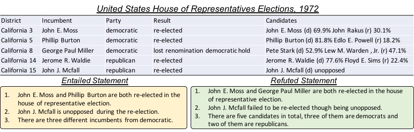

# Introduction
We introduce a large-scale dataset called **TabFact**, which consists of 118,439 manually annotated statements with regard to 16,621 Wikipedia tables, their relations are classified as *ENTAILED* and *REFUTED*.



## Requirements
- Python 2.7
- Pytorch 1.0
- Pandas

## Data Preprocessing Pipeline
- collected_data: This folder contains the raw data collected directly from Mechnical Turker, all the text are lower-cased, containing foreign characters under some tables. There are two files, the r1 file is collected in the first easy round, which contains sentences involving less reasoning. The r2 file contains the sentences involving more complex reasoning. The two files in total contains roughly 110K statements. 
  ```
  Table-id: {
  [
  Statement 1,
  Statement 2,
  ...
  ],
  [
  Label 1,
  Label 2,
  ...
  ],
  Table Caption
  }
  ```
- tokenized_data: This folder contains the data after tokenization, the data is obtained using the script preprocess_data.py, you can simply reproduce it by:
  ```
  python preprocess_data.py
  ```
  this script is mainly used to perform feature-based entity linking, the entities in the statements are linked to the cell values in the table, the obtained file is tokenized_data/full_cleaned.json, the data format looks like:
  ```
  Table-id: {
  [
  Statement 1: xxxxx #xxx;idx1,idx2# xxx.
  Statement 2: xx xxx #xxx;idx1,idx2# xxx. 
  ...
  ],
  [
  Label 1,
  Label 2,
  ...
  ],
  Table Caption
  }
  ```
  here the enclosed snippet #xxx;idx1,idx2# denotes that the work "xxx" is linked to the entity residing in idx1-th row and idx2-th column of table "Table-id.csv", if idx1=-1, it means that it links to the caption. The entity linking step is essential for performing program search algorithm to connect these entities with known functions for semantic representation.
- preprocessed_data_program: This folder contains the preprocessed.json, which is obtained by:
  ```
  python run.py
  ```
  this script is mainly used to perform buffer initialization, the result file looks like:
  ```
  [
    [
    Table-id,
    Statement: xxx #xxx;idx1,idx2# (after entity linking),
    Pos-Tagging information,
    Statement with place-holder,
    [linked string entity],
    [linked number entity],
    [linked string header],
    [linked number header],
    Statement-id,
    Label
    ],
  ]
  ```
  This file is directly fed into run.py to search for program candidates using dynamic programming. This folder also contains the tsv files neccessary for learning the ranking algorithm.
- all_programs: this folder contains the searched results for different statements, for each result file, the format looks like:
  ```
  [
    csv_file,
    statement,
    placeholder-text,
    label,
    [
      program1,
      program2,
      ...
    ]
  ]
  ```
## Downloading the preprocessed data
Here we provide the data we obtained after preprocessing through the above pipeline, you can download that by running

```
  sh get_data.sh
```

## Training the ranking model
Once we have all the training and evaluating data in folder "preprocessed_data_program", we can simply run the following command to evaluate the fact verification accuracy as follows:

```
  cd code/
  python model.py --do_train --do_val
```
